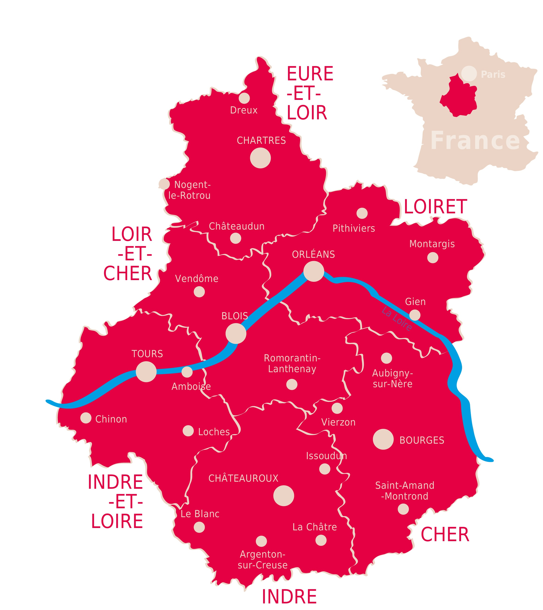
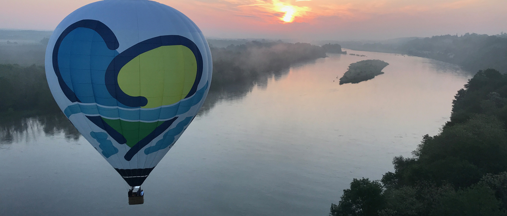

# CENTRE VAL DE LOIRE

---
**[`Retour à l'accueil`](index.md)**&nbsp;&nbsp;&nbsp;&nbsp;&nbsp;&nbsp;&nbsp;&nbsp;&nbsp;&nbsp;&nbsp;&nbsp;**[`La Ville`](ma-ville.md)** &nbsp;&nbsp;&nbsp;&nbsp;&nbsp;&nbsp;&nbsp;&nbsp;&nbsp;&nbsp;&nbsp;&nbsp;**[`Le Departement`](mon-departement.md)**

---
<!-- no toc -->
- [LE RELIEF ET LE CLIMAT](#le-relief-et-le-climat)
- [LA POPULATION](#la-population)
- [L'ÉCONOMIE](#léconomie)
- [L'AGRICULTURE](#lagriculture)
- [L'INDUSTRIE](#lindustrie)
- [LES SERVICES](#les-services)

## LE RELIEF ET LE CLIMAT

Au N. de la Loire, qui la coupe d'E. en O. à peu près en son milieu, une plaine de grande culture, la Beauce, s'ouvre entre des horizons vallonnés, boisés ou bocagers, plus propices à l'élevage (Perche, Gâtine tourangelle, Gâtinais). Au S., des plateaux calcaires céréaliers (plateau de Sainte-Maure, Champeigne, Champagne berrichonne) alternent avec des pays d'herbages (Gâtines de Loches et de Valençay, Pays Fort, Boischaut, vallée de Germigny) et d'étangs (Sologne, Brenne). La modération du climat (+ 3 °C en janvier, + 19 °C en juillet, 600 mm de précipitations bien réparties sur l'année) souligne les aptitudes agricoles de la Région.

## LA POPULATION

Le Centre-Val de Loire a connu très tôt l'exode rural vers Paris. Cependant sa population s'accroît modestement mais régulièrement depuis les années 1950, l'accroissement naturel et l'apport migratoire y contribuant à part pratiquement égale. Les mouvements migratoires sont intenses essentiellement en relation avec l'Île-de-France, en particulier pour l'Eure-et-Loir. Les personnes qui arrivent sont jeunes (entre 18 et 39 ans) pour moitié, celles qui partent le sont aussi pour 50 % d'entre elles, mais s'y ajoutent des jeunes de 18-24 ans à hauteur de 20 % du total.

La densité de la population est plus de moitié inférieure à la moyenne française, mais la réalité montre de forts contrastes entre les six départements ; l'Indre est pratiquement trois fois moins densément peuplée que les deux départements qui viennent en tête, le Loiret et l'Indre-et-Loire. Par ailleurs les trois-quarts des habitants vivent dans des zones à dominante urbaine. Les deux plus grandes agglomérations, Tours et Orléans,longtemps concurrentes, représentent plus de 20 % du total régional. Les villes moyennes sont à l'image du contraste déjà évoqué. Elles sont plus nombreuses dans la moitié nord que dans la partie sud.

## L'ÉCONOMIE

Le Centre-Val de Loire, dont le développement récent a connu un rythme légèrement inférieur à la moyenne des Régions françaises, se caractérise par la forte présence des ressources agricoles et industrielles et un moindre développement des activités tertiaires supérieures.

## L'AGRICULTURE

Grande région agricole, le Centre-Val de Loire est dans les tout premiers rangs pour le blé, l'orge, et le maïs, qui occupent la moitié de la superficie agricole. La gamme des productions est remarquable, cultures industrielles avec la betterave sucrière, le colza et le tournesol, fourragères, légumières (Val de Loire), fruitières (Touraine), florales (roseraies d'Orléans, pépinières). Des vignobles de qualité occupent les coteaux de la Loire, du Cher, de la Vienne avec des appellations contrôlées : Sancerre, Vouvray, Montlouis, Bourgueil, Chinon notamment.

L'élevage concerne les bovins (plus de 600 000) ,les ovins (plus de 200 000), les porcins (plus de 350 000), les caprins (141 000 chèvres [fromages]), et les volailles. S'y ajoutent l'apiculture et la cuniculiculture du Gâtinais, la pisciculture et des élevages de gibier, associés à l'économie cynégétique de la Sologne.

Les forêts, Sologne et forêt d'Orléans principalement, occupent environ 20 % du territoire régional. Les feuillus y sont dominants, en particulier le chêne.

## L'INDUSTRIE

La production industrielle est diversifiée. Fondé historiquement sur les ressources locales, l'agroalimentaire reste important et varié : laiteries, sucreries, distilleries, meunerie, conserves notamment, tandis que le secteur des produits réfractaires (briqueteries, tuileries, faïenceries, porcelaineries) se maintient.

La Région a largement bénéficié de la décentralisation industrielle en raison des bonnes communications avec Paris et de la présence de main d'œuvre disponible. Cependant depuis le début des années 2000, les restructurations ont gravement atteint l'emploi industriel, en particulier l'automobile, surtout dans le sud de la Région où l'Indre a perdu environ 15 % de son potentiel industriel. En Eure-et-Loir, la région Drouaise a attiré de nouvelles entreprises après des fermetures dans le secteur des matériels électriques et électroniques.

Le secteur chimie, énergie, caoutchouc, plastiques, produits pharmaceutiques et cosmétiques, est l'un des secteurs majeurs, avec environ un tiers de l'emploi salarié et une présence affirmée autour de Chartres. Le pôle de compétitivité à vocation nationale Cosmetic Valley y fédère des objectifs ambitieux dans le domaine de la recherche. Le secteur de la fabrication de médicaments (1er rang français), se structure également en une Pharma Valley. De même Elastopole a été labellisé en 2007 pour le caoutchouc tandis que, sous l'impulsion d'entreprises tourangelles, le pôle Sciences et systèmes de l'énergie électrique regroupe de nombreuses sociétés. Globalement l'objectif est de renforcer le potentiel des PME vers des productions à plus forte valeur ajoutée et celui de la main d'oeuvre en améliorant le niveau des compétences.

Par l'implantation des centrales de Dampierre-en-Burly, Saint-Laurent-des-Eaux, Avoine-Chinon et Belleville-sur-Loire, la Région Centre-Val de Loire participe de façon significative à la production électronucléaire française.

## LES SERVICES

Le secteur tertiaire occupe la première place dans l'emploi régional. Le secteur administratif et financier a profité de la décentralisation, notamment autour d'Orléans. S'y sont ajoutés plus récemment la création de centres d'appel.

Cinq autoroutes traversent le Centre-Val de Loire, très bien équipé en plateformes logistiques, particulièrement le Loiret autour d'Orléans. Le transport ferroviaire s'appuie sur les gares d'Orléans-Les Aubrais, Tours-Saint-Pierre-des-Corps, avec le T.G.V., Vierzon et Saincaise (fret). Les infrastructures de transport intrarégionales ont été renforcées (TER). S'y ajoutent deux aéroports, celui de de Tours et celui de de Châteauroux, particulièrement dédié au fret.

Les deux pôles universitaires, Tours et Orléans, se développent, bien que la population étudiante n'atteigne pas la proportion qu'elle devrait représenter, 2,5 % pour 4 % de la population française. Des équipements de rang national, le centre des congrès à Tours par exemple renforcent le potentiel des services supérieurs.

Région « verte », bien reliée à Paris, le Centre-Val de Loire accueille depuis longtemps des résidences secondaires. Mais surtout ses ressources patrimoniales sont très nombreuses : 2 675 monuments historiques, 65 musées labellisés Musées de France, dont le tiers environ dans le département d'Indre-et-Loire; au total plus de 3 000 emplois sont répertoriés dans les filières culturelles. La Région accueille chaque année 4 500 000 visiteurs environ, notamment dans les châteaux de la Loire, parmi lesquels le Château de Chambord est l'un des momuments les plus visités de France. Par ailleurs 7 villes ont reçu le label Villes et pays d'art et d'histoire, Blois, Bourges, Chinon, Loche, Orléans, Tours et Vendôme.

Une partie des départements du Loiret, du Loir-et-Cher et de l'Indre-et-Loire est située dans le périmètre du Val-de-Loire, zone classée au patrimoine mondial de l'humanité par l'Unesco. En outre, le Parc naturel régional de la Brenne ainsi qu'une partie des Parcs Loire-Anjou-Touraine et Perche, contribuent à la préservation de l'environnement. Le plan Loire grandeur nature, adopté en 1994, a fixé le cadre de l'aménagement de ce fleuve « sauvage ».

 Venez découvrir cette région formidable ! :wink:

 [Haut](#centre-val-de-loire)
  