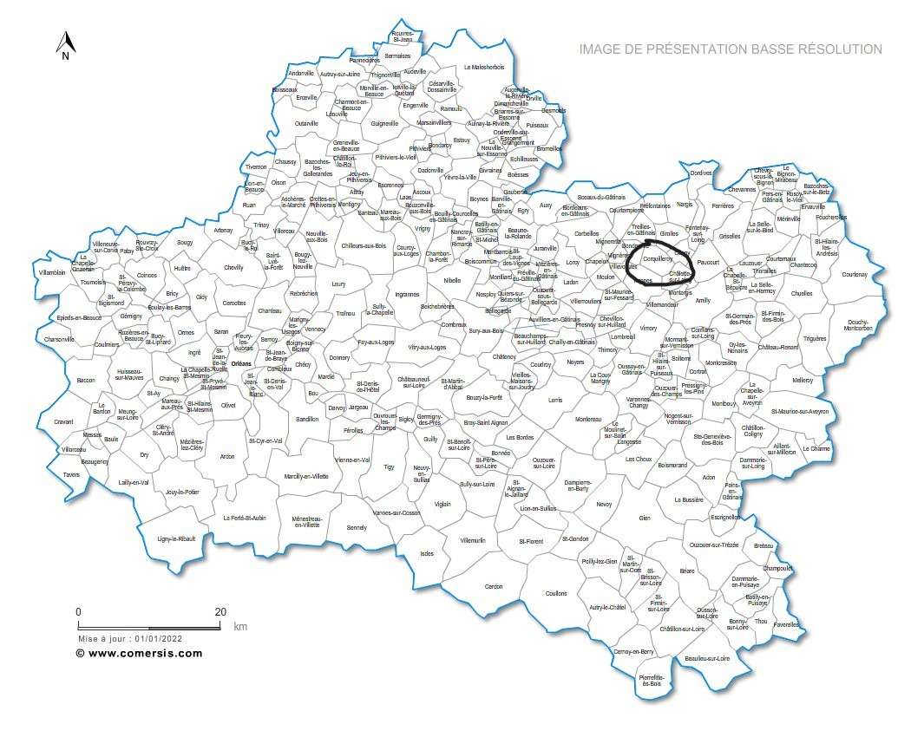
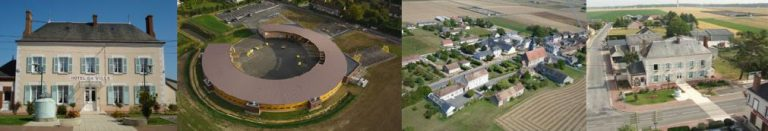

# CORQUILLEROY

## Le Village aux 3 canaux

---
**[`Retour à l'accueil`](index.md)**&nbsp;&nbsp;&nbsp;&nbsp;&nbsp;&nbsp;&nbsp;&nbsp;&nbsp;&nbsp;&nbsp;&nbsp;&nbsp;**[`Le Departement`](mon-departement.md)**&nbsp;&nbsp;&nbsp;&nbsp;&nbsp;&nbsp;&nbsp;&nbsp;&nbsp;&nbsp;&nbsp;&nbsp;&nbsp;**[`La region`](ma-region.md)**

---
<!-- no toc -->
- [Zone artisanale et commerces](#zone-artisanale-et-commerces)
- [Loisirs et culture](#loisirs-et-culture)
- [Equipements communaux](#equipements-communaux)
  

**Corquilleroy** est une commune de **2896** habitants, située au **Nord-Ouest de Montargis.**
Commune à la fois rurale et urbaine, elle joint le calme de la campagne à la proximité de Montargis et de son agglomération dont elle n’est distante que de 5 kilomètres.
Actuellement, elle comprend deux centres principaux : le Bourg et Bûges, distants l’un de l’autre de 2 kilomètres environ, et des hameaux disséminés sur toute la superficie (1396 hectares). Sur le hameau de Bûges se trouve le point de jonction des trois canaux, les canaux de Briare et d’Orléans reliant la Loire et les canaux de Briare et du Loing reliant la Seine.
Deux autoroutes traversent la commune : l’A 77 et l’A 19.

### Zone artisanale et commerces

La Zone Artisanale du Bigot a été créée **en 1990** sur un terrain de 3 hectares en bordure de la RD 40.
Une douzaine d’entreprises y sont aujourd’hui implantées.
Au point de vue commerce, les habitants disposent dans le Bourg d’un **bar-restaurant, d’une boulangerie, d’une pharmacie et d’un coiffeur.**
La zone de chalandise la plus proche se trouve à Châlette-sur-Loing, commune limitrophe.

### Loisirs et culture

Une vie associative importante existe à Corquilleroy, comme l’association sportive qui regroupe le foot, le tennis, la gymnastique volontaire féminine.
Des associations de personnes âgées, une société de chasse ainsi qu’un comité des fêtes sont également actifs.
La commune étant située à la jonction des trois canaux (Briare, Loing et Orléans), la pêche y est également importante.
Corquilleroy est doté de divers équipements :

- bibliothèque
- salle polyvalente et salle de réunion,
- maison des associations.
- city park
- aire de jeux pour enfants au stade Jean-Pierre ADAMS

### Equipements communaux

La commune dispose d’un groupe scolaire comprenant une école maternelle et une école primaire (du CP au CM2).
Une garderie périscolaire accueille les enfants de 6h45 à 8h30 et de 16h30 à 18h30, les jours d’école.

>**Contact :**
_Mairie de Corquilleroy
1, rue Prudent Harry
45 120 CORQUILLEROY
Tél : 02.38.87.86.09
Fax : 02.38.87.88.37
Mail : corquilleroy@orange.fr_

[Haut](#corquilleroy)
  