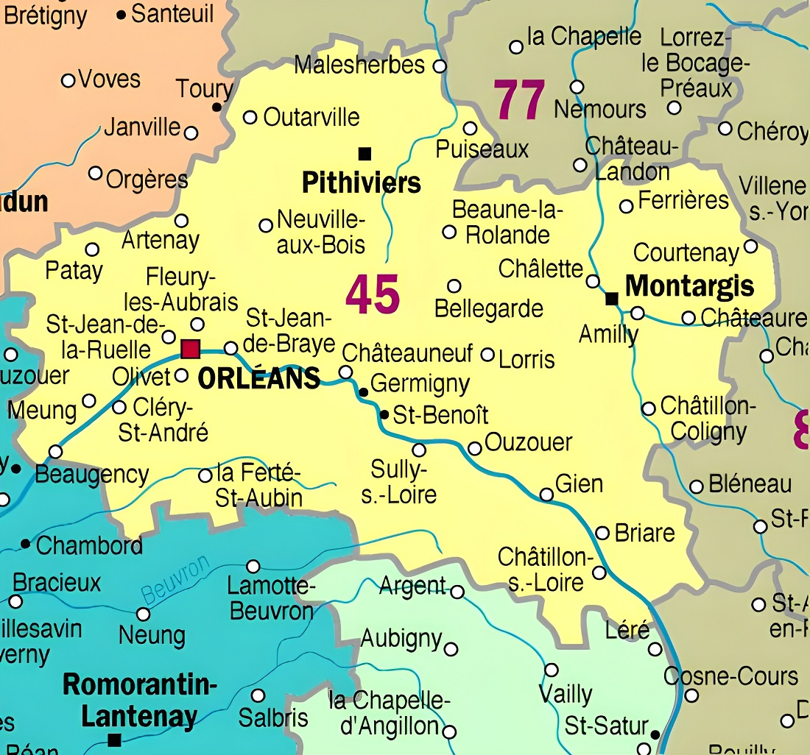
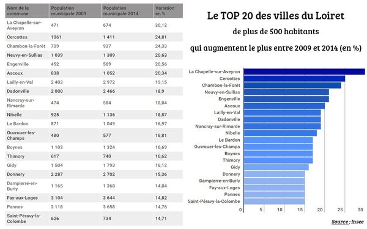

# LE LOIRET

---
**[`Retour à l'accueil`](index.md)**&nbsp;&nbsp;&nbsp;&nbsp;&nbsp;&nbsp;&nbsp;&nbsp;&nbsp;&nbsp;&nbsp;&nbsp;&nbsp;**[`La Ville`](ma-ville.md)**&nbsp;&nbsp;&nbsp;&nbsp;&nbsp;&nbsp;&nbsp;&nbsp;&nbsp;&nbsp;&nbsp;**[`La region`](ma-region.md)**

---

Le département du Loiret est un département français de la région [Centre-Val de Loire](ma-region.md). L'Insee et la Poste lui attribuent le code **45**. Sa préfecture est Orléans et c'est aussi le chef-lieu de la région. Situé à une centaine de kilomètres au sud de Paris, il tire son nom de la rivière du Loiret.

Le Loiret compte désormais 669.737 habitants. C'est 4.150 de plus qu'en 2013 (+ 0,6%)

## Les plus grandes villes du Loiret

Orléans,
Fleury-les-Aubrais,
Olivet,
Saint-Jean-de-Braye,
Saint-Jean-de-la-Ruelle,
Montargis,
Gien,
Saran,
Châlette-sur-Loing,
Amilly,
La Chapelle-Saint-Mesmin,
Pithiviers,
Saint-Jean-le-Blanc,
Ingré,
Chécy,
Châteauneuf-sur-Loire,
Beaugency,
Saint-Denis-en-Val

Le Loiret possède un riche patrimoine reconnu : châteaux, édifices religieux, musées mais aussi des trésors d'une grande qualité.

[Haut](#le-loiret)
  